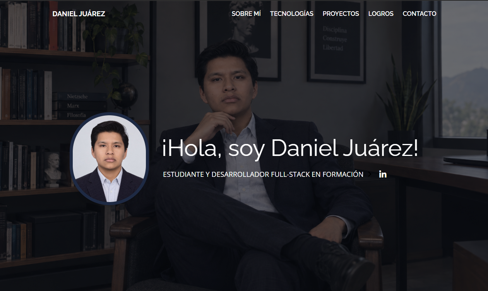
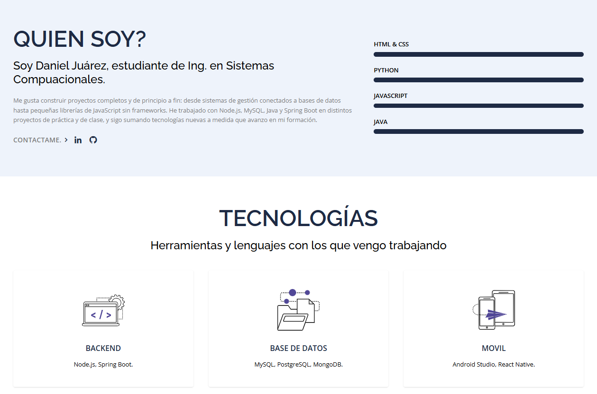
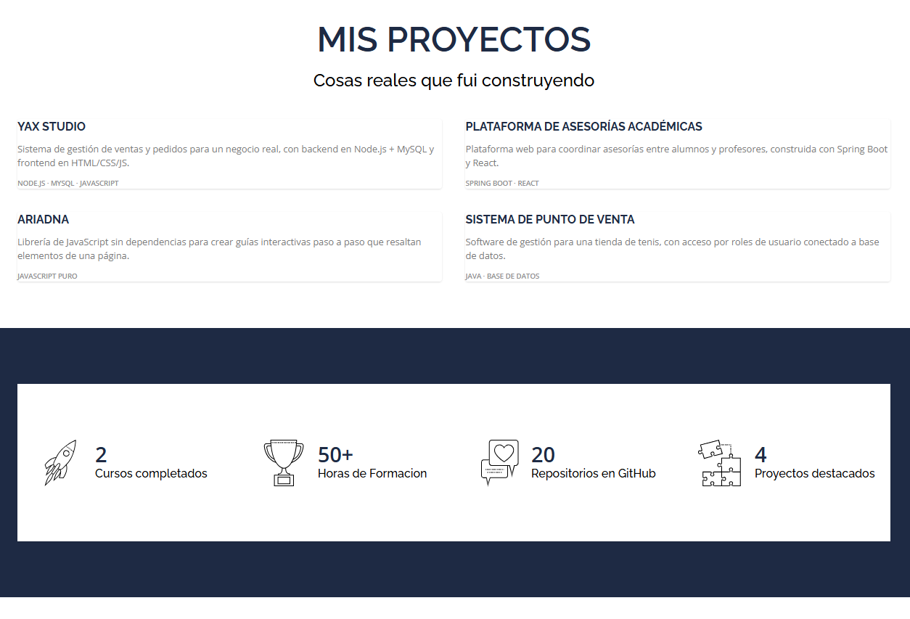
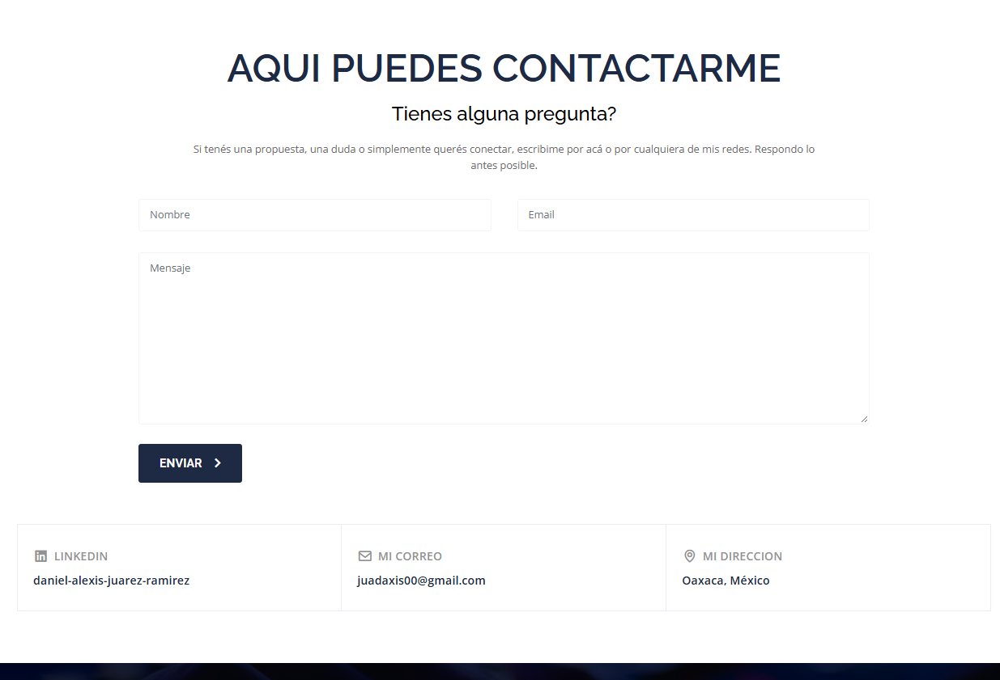

# Portafolio Personal — Daniel Juárez

Portafolio web personal construido con **HTML, Tailwind CSS y JavaScript**, como actividad de clase. Documenta mi perfil como estudiante de programación, mis tecnologías, mis proyectos reales y mis formas de contacto.

 **Repositorio:** https://github.com/DaniielA5/mi-portafolio
 **GitHub Pages (en vivo):** https://daniiela5.github.io/mi-portafolio/

---

## Descripción del proyecto

- **Framework CSS:** Tailwind CSS (usado vía CSS ya compilado, con Alpine.js para las interacciones del menú).
- **Plantilla base:** [Atom](https://themewagon.com/themes/atom-tailwind/) de ThemeWagon — plantilla gratuita de portafolio de una sola página, hecha con Tailwind CSS y Alpine.js.
- **Secciones del portafolio:**
  | Sección | Contenido |
  |---|---|
  | **Inicio** | Foto de perfil, nombre y una frase de presentación como estudiante y desarrollador en formación. |
  | **Sobre mí** | Biografía corta contando quién soy y qué tecnologías vengo aprendiendo, más 4 barras de nivel en HTML & CSS, JavaScript, Node.js/MySQL y Java. |
  | **Tecnologías** | Mi stack organizado por categoría: Lenguajes, Frontend, Backend, Bases de datos, Móvil y Herramientas. |
  | **Proyectos** | 4 proyectos reales que desarrollé (YAX Studio, Plataforma de Asesorías Académicas, Ariadna y un Sistema de Punto de Venta), cada uno con link directo a su repositorio en GitHub. |
  | **Logros** | Cursos completados, horas de formación, repositorios en GitHub y proyectos destacados. |
  | **Contacto** | Email, LinkedIn y ubicación, más un formulario de contacto. |

---

## Proceso de creación

1. **Elección del framework y la plantilla.** Definí trabajar con Tailwind CSS y, después de comparar varias opciones (Bootstrap, HTML5UP, HyperUI), elegí la plantilla **Atom** de ThemeWagon por ser gratuita, estar hecha en Tailwind + Alpine.js (sin React/Vue) y traer ya las secciones que necesitaba (perfil, skills, portfolio, contacto).

2. **Armado de la estructura del repositorio.** Organicé el proyecto en `index.html`, `css/` (con el Tailwind ya compilado más `portafolio.css` para estilos propios), `js/` y `img/`, tal como pide la consigna. La plantilla original usaba rutas absolutas (`/assets/...`), así que corregí todas las referencias a rutas relativas dentro de esas carpetas.

3. **Reemplazo de todo el contenido de ejemplo por información real.** La plantilla venía con datos de una persona ficticia (nombre, biografía, clientes falsos como Apple o Netflix, experiencia laboral inventada). Saqué las secciones que no correspondían a un portafolio de estudiante (Clientes, Experiencia laboral falsa, Blog) y reemplacé el resto por mi información real: mi nombre, una biografía escrita por mí, mis 4 proyectos reales tomados de mi GitHub, mi stack de tecnologías organizado por categoría, y mis logros reales (cursos completados en Platzi, horas de formación, repositorios).

4. **Foto de perfil y color.** Reemplacé la imagen genérica del hero por mi foto real, con criterio profesional (buena iluminación, fondo neutro). A partir de esa foto armé una paleta de colores propia —marino y celeste— reemplazando el violeta original de la plantilla en el CSS compilado.

5. **Traducción y limpieza.** Traduje todo el menú de navegación al español, corregí links de redes sociales para que apunten a mis perfiles reales (LinkedIn, GitHub) y saqué elementos decorativos que no aportaban valor real (un mapa estático sin ubicación real).

6. **Publicación.** Subí el proyecto a un repositorio público en GitHub y activé GitHub Pages para tener el portafolio funcionando en vivo.

---

## Capturas de pantalla

---

## Tecnologías utilizadas

- HTML5
- Tailwind CSS
- Alpine.js (interacciones del menú)
- JavaScript

## Autor

**Daniel Juárez** —  [GitHub](https://github.com/DaniielA5)